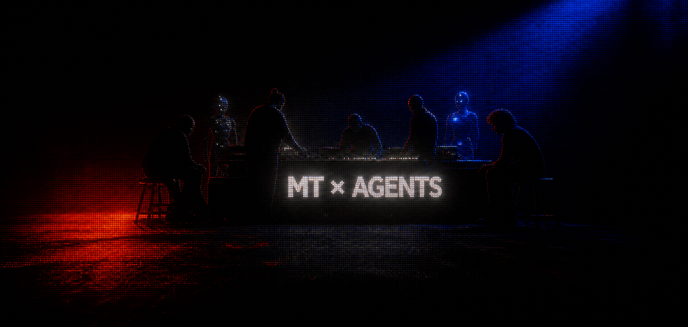

<div align="center">
  <picture>
    <source media="(prefers-reduced-motion: reduce)" srcset="./assets/mt-agents.png" />
    
  </picture>

  <p>
    <a href="https://github.com/tutti-os/tutti"><b>TUTTI</b></a>
    &nbsp;&nbsp; / &nbsp;&nbsp;
    <a href="https://github.com/mt-hub8/MindWeaver"><b>MINDWEAVER</b></a>
    &nbsp;&nbsp; / &nbsp;&nbsp;
    <a href="https://github.com/mt-hub8/codepet"><b>CODEPET</b></a>
  </p>
</div>

## Profile

I build systems where people and AI agents can work together with shared context, reliable runtime behavior, and clear interaction boundaries. As an active contributor to **[Tutti](https://github.com/tutti-os/tutti)**, I work across AgentGUI interaction, cross-agent session routing, desktop Agent mode, provider compatibility, and agent runtime reliability.

Alongside open-source agent infrastructure, I build local-first products such as **MindWeaver** and **CodePet**, carrying the same focus on observability, privacy, and dependable system behavior into personal AI applications.

My current development path connects three layers:

| TUTTI | AI SYSTEMS | PRODUCTS |
|:--|:--|:--|
| AgentGUI · Session/Turn/Goal · Cross-Agent Workflows | RAG · Retrieval Evaluation · Memory · Orchestration | Personal Knowledge Workspace · AI Desktop Companion |

> Build locally. Make behavior observable. Verify before claiming. Ship the whole experience.

## Selected systems

### 01 / Tutti

A shared workspace where people and AI agents build together.

TypeScript · Go · AgentGUI · ACP

[Repository](https://github.com/tutti-os/tutti) · [Website](https://tutti.sh/zh) · [Contributions](https://github.com/tutti-os/tutti/pulls?q=is%3Apr+author%3Amt-hub8)

### 02 / MindWeaver

A local-first personal AI knowledge workspace.

Java · Spring Boot · Python · Ollama · Qdrant

[Repository](https://github.com/mt-hub8/MindWeaver)

### 03 / CodePet

A local-first AI desktop companion for developers.

Tauri · TypeScript · Local AI

[Repository](https://github.com/mt-hub8/codepet) · [Releases](https://github.com/mt-hub8/codepet/releases)

## Engineering trajectory

```text
TUTTI AGENT INFRASTRUCTURE
        ↓
PROVIDER-NEUTRAL SESSION / TURN / GOAL
        ↓
RUNTIME RELIABILITY + INTERACTION UX
        ↓
LOCAL-FIRST RAG + SCOPED MEMORY
        ↓
AI KNOWLEDGE & DESKTOP PRODUCTS
```

Across Tutti and my own products, I follow the same engineering direction: define dependable agent lifecycle boundaries, make state and failure visible, measure retrieval and generation quality, then turn the infrastructure into an experience people can actually use.

## Engineering stack

| AREA | WORKING SET |
|:--|:--|
| **Agent Infrastructure** | Tutti · AgentGUI · ACP · Session/Turn/Goal · Runtime Recovery |
| **AI Systems** | RAG · Hybrid Search · RRF · Reranking · Grounded Generation · Agent Memory |
| **Backend** | Java · Spring Boot · Python · REST · Async Task Processing |
| **Local Runtime** | Ollama · Qdrant · MySQL · RabbitMQ |
| **Product** | TypeScript · JavaScript · Tauri · Desktop Integration · HTML/CSS |
| **Delivery** | Docker · GitHub Actions · Windows Packaging · Automated Tests |

## Current direction

- Contributing to Tutti's provider-neutral agent architecture, interaction model, and cross-agent workflow experience.
- Advancing MindWeaver from isolated agent profiles and scoped memory toward multi-agent orchestration.
- Improving retrieval quality through controlled evaluation rather than replacing a working pipeline on intuition.

<sub>Research track: evaluating local LightRAG integration in the isolated <a href="https://github.com/mt-hub8/lightrag-spike">lightrag-spike</a> before considering changes to the main retrieval path.</sub>

## Activity

<picture>
  <source media="(prefers-color-scheme: dark)" srcset="https://raw.githubusercontent.com/mt-hub8/mt-hub8/output/github-contribution-grid-snake-dark.svg" />
  <source media="(prefers-color-scheme: light)" srcset="https://raw.githubusercontent.com/mt-hub8/mt-hub8/output/github-contribution-grid-snake.svg" />
  
</picture>

<div align="center">

<sub>DESIGN THE SYSTEM · VERIFY THE BEHAVIOR · SHIP THE PRODUCT</sub>

</div>
