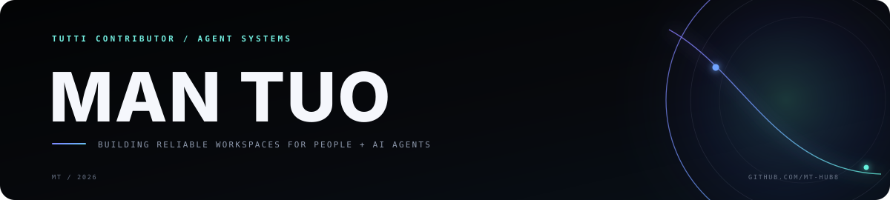

<div align="center">
  

  <br />

  <a href="https://github.com/mt-hub8/MindWeaver"></a>
  <a href="https://github.com/mt-hub8/codepet"></a>
  <a href="https://github.com/mt-hub8/mayWatch"></a>

  <p><sub>LOCAL-FIRST AI · RETRIEVAL SYSTEMS · AGENT TOOLING · PRODUCT ENGINEERING</sub></p>
</div>

## Profile

I design and ship **local-first AI systems** that turn complex infrastructure into useful products. My work starts with reliable backends and retrieval engineering, then moves upward into grounded answers, scoped memory, agent workflows, and human-facing tools.

My current development path connects three layers:

| SYSTEMS | INTELLIGENCE | PRODUCTS |
|:--|:--|:--|
| Spring Boot · Python Runtime · Async Workflows | RAG · Hybrid Retrieval · Evaluation · Memory | Personal Knowledge Workspace · Desktop Companion · Browser Tools |

> Build locally. Make behavior observable. Verify before claiming. Ship the whole experience.

## Selected systems

### 01 / [MindWeaver](https://github.com/mt-hub8/MindWeaver)

**A local-first personal AI knowledge workspace.**

MindWeaver turns private documents into a searchable, traceable knowledge system. It covers the full path from ingestion and vector indexing to hybrid retrieval, cited answers, RAG quality diagnostics, scoped memory, agent profiles, and task orchestration.

`Java` `Spring Boot` `Python` `Ollama` `Qdrant` `MySQL` `RabbitMQ`

<a href="https://github.com/mt-hub8/MindWeaver/commits/main"></a>


### 02 / [CodePet](https://github.com/mt-hub8/codepet)

**A local-first AI desktop companion for developers.**

CodePet brings reminders, local Ollama chat, command monitoring, coding-agent status, dependency diagnostics, and lightweight behavior memory into a desktop companion. It is packaged as a Windows-first public beta with a privacy-first local data model.

`Tauri` `TypeScript` `Local AI` `Agent Monitoring` `GitHub Actions`

<a href="https://github.com/mt-hub8/codepet/releases"></a>
<a href="https://github.com/mt-hub8/codepet/actions/workflows/build.yml"></a>

### 03 / [mayWatch](https://github.com/mt-hub8/mayWatch)

**A zero-dependency Chrome extension for real-time page monitoring.**

mayWatch tracks pages or selected elements, computes multi-level text diffs, extracts numeric trends, and sends optional Feishu notifications. Its floating interface is isolated with Shadow DOM while all monitoring data remains in local browser storage.

`Chrome MV3` `JavaScript` `Shadow DOM` `Myers Diff` `Chart.js`

<a href="https://github.com/mt-hub8/mayWatch/blob/main/LICENSE"></a>
<a href="https://github.com/mt-hub8/mayWatch/commits/main"></a>

## Engineering trajectory

```text
DOCUMENT INGESTION
        ↓
HYBRID RETRIEVAL + EVALUATION
        ↓
GROUNDED ANSWERS + CITATION VERIFICATION
        ↓
SCOPED MEMORY + AGENT PROFILES
        ↓
TASK ORCHESTRATION
        ↓
LOCAL-FIRST DESKTOP & BROWSER PRODUCTS
```

This progression reflects how I approach AI development: establish a dependable system boundary first, make retrieval and generation measurable, then productize the capability without giving up privacy or observability.

## Engineering stack

| AREA | WORKING SET |
|:--|:--|
| **AI Systems** | RAG · Hybrid Search · RRF · Reranking · Grounded Generation · Agent Memory |
| **Backend** | Java · Spring Boot · Python · REST · Async Task Processing |
| **Local Runtime** | Ollama · Qdrant · MySQL · RabbitMQ |
| **Product** | TypeScript · JavaScript · Tauri · Chrome Extensions · HTML/CSS |
| **Delivery** | Docker · GitHub Actions · Windows Packaging · Automated Tests |

## Current direction

- Advancing MindWeaver from isolated agent profiles and scoped memory toward multi-agent orchestration.
- Improving retrieval quality through controlled evaluation rather than replacing a working pipeline on intuition.
- Building local AI products that expose state, evidence, and failure modes to the user.

<sub>Research track: evaluating local LightRAG integration in the isolated <a href="https://github.com/mt-hub8/lightrag-spike">lightrag-spike</a> before considering changes to the main retrieval path.</sub>

## Activity

<picture>
  <source media="(prefers-color-scheme: dark)" srcset="https://raw.githubusercontent.com/mt-hub8/mt-hub8/output/github-contribution-grid-snake-dark.svg" />
  <source media="(prefers-color-scheme: light)" srcset="https://raw.githubusercontent.com/mt-hub8/mt-hub8/output/github-contribution-grid-snake.svg" />
  
</picture>

<div align="center">

<sub>DESIGN THE SYSTEM · VERIFY THE BEHAVIOR · SHIP THE PRODUCT</sub>

</div>
